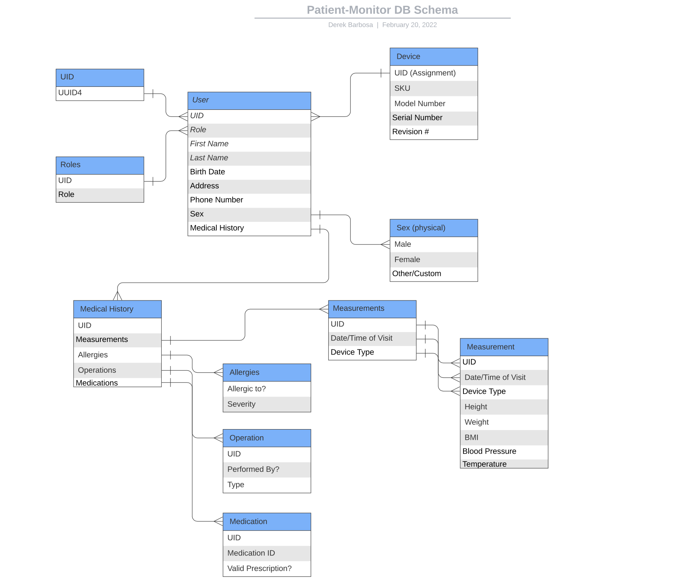

# Patient Monitor System

### Branches:
I will be using separate branches, and merging them one-by-one on successful unit tests

Current testing suite -- 14 tests
Tests currently cover:
* Model creation and retrieval 
* GET request retrieval/serialization

## Active Branches:
* Main

## Inactive Branches
* chat_module (DELETED, merged into main 3/23/22)
* endpoints (DELETED, merged into main 3/25/22)
* queueing (DELETED, merged into main 3/25/22)

## How to use this API:
Currently, all views are serialized. Specified endpoints + cleanup will be coming soon.

Deploying the app locally will allow you to GET/POST to the endpoints specified in the models.py

Doing a "Get" request on /users/ will allow you to view the list of users :), same for all other endpoints (devices, medhistory, allergies, etc).

POST requests as of now MUST be sent with HTML form data, otherwise a generic default user will be created :) (or nothing at all). Using only query params will not work!

You CANNOT modify an entry with POST as of right now. Look up your entry with the specific ID, and post using HTML form data :)

## How my data will be organized:

